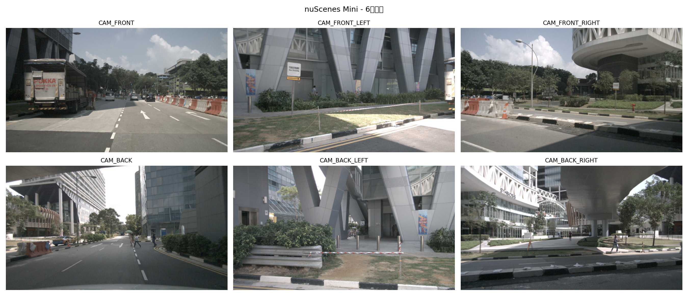
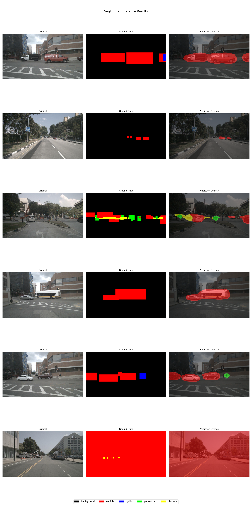
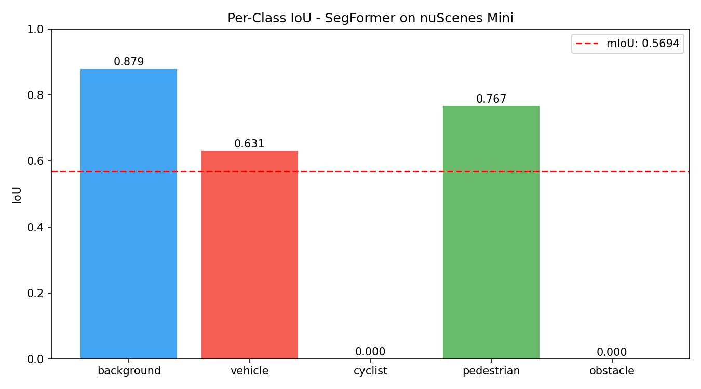
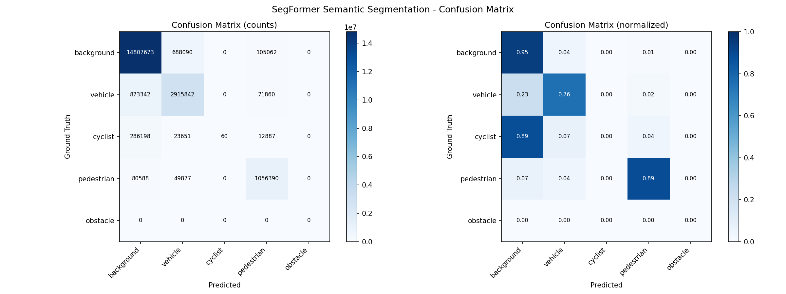
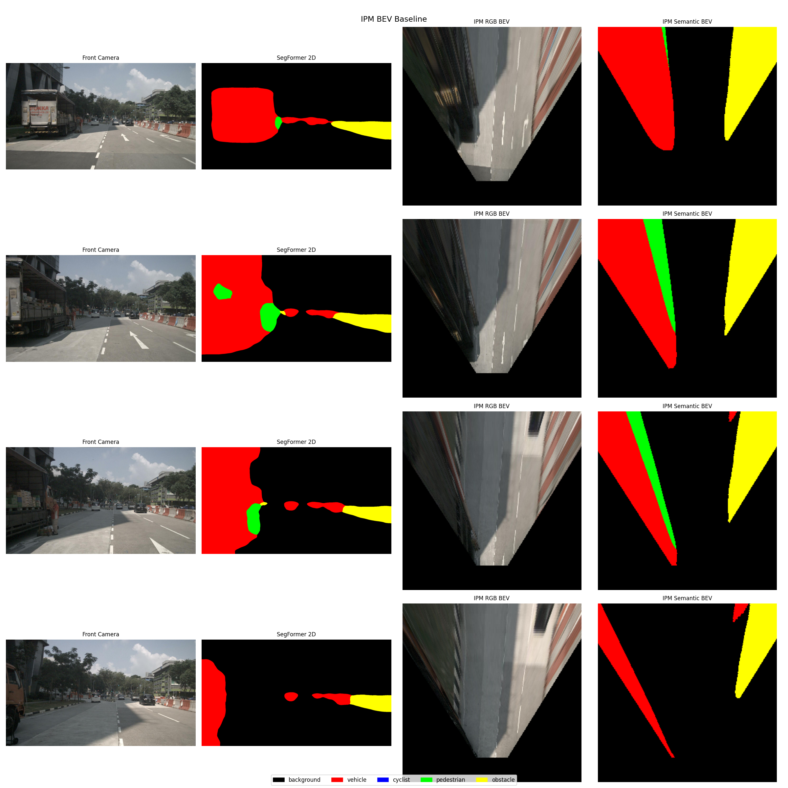
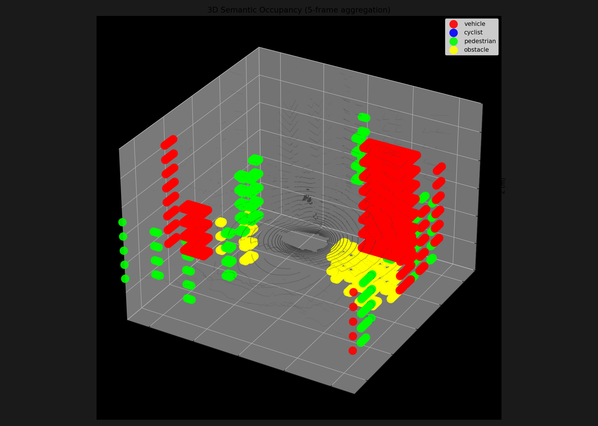
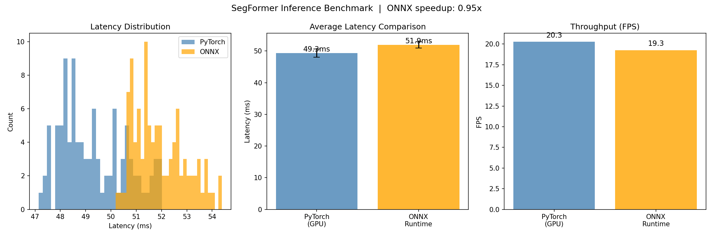

# Camera-Based BEV Occupancy Perception System

> A complete autonomous driving perception pipeline built on nuScenes,
> covering 2D semantic segmentation → BEV transformation → 3D occupancy prediction → model deployment.

---

## Demo

### 6-Camera Surround View

### SegFormer 2D Semantic Segmentation

### Per-Class IoU

### Confusion Matrix

### IPM BEV Projection

### 3D Semantic Occupancy Grid (5-frame aggregation + ego-motion compensation)

### Inference Benchmark (T4 GPU)

---

## Pipeline Overview

**nuScenes Mini** → **2D Semantic Segmentation** (SegFormer-B2, mIoU: 0.5694) → **BEV Transformation** (IPM baseline + LSS Lift-Splat-Shoot) → **3D Occupancy Grid** (LiDAR voxelization + 5-frame aggregation) → **ONNX Deployment** (~106MB, verified numerical parity, ~49ms on T4 GPU)

---

## Results

| Module | Metric | Value |
|--------|--------|-------|
| SegFormer 2D Segmentation | Val mIoU (scene-level split) | 0.5694 |
| SegFormer per-class IoU | background / vehicle / pedestrian | 0.879 / 0.631 / 0.767 |
| SegFormer per-class IoU | cyclist / obstacle | 0.000 / N/A (not in val scenes) |
| ONNX Export Accuracy | Max error vs PyTorch | < 1e-5 |
| GPU Inference Speed | FPS (T4) | 20.3 |
| ONNX Model Size | Total file size | ~106 MB |
| Occupancy Temporal Fusion | Frames aggregated | 5 + ego-motion compensation |

---

## Project Structure

- `config.py` — Global config: paths, hyperparameters, classes
- `setup_colab.py` — One-click Colab environment initialization
- `train_seg.py` — SegFormer training with checkpoint resume
- `infer_seg.py` — Inference and visualization
- `evaluate.py` — Per-class IoU and confusion matrix evaluation
- `train_bev.py` — LSS BEV training
- `visualize_bev.py` — IPM vs LSS comparison visualization
- `datasets/nuscenes_seg.py` — Dataset class with scene-level split
- `models/segformer.py` — Model definition and weight loading
- `utils/visualize.py` — Visualization utilities
- `utils/mask_generator.py` — 3D box to 2D pseudo label projection
- `bev/ipm.py` — Inverse Perspective Mapping
- `bev/lss.py` — Lift-Splat-Shoot full implementation
- `occupancy/voxel.py` — Voxel grid + multi-frame aggregation
- `occupancy/visualize_occ.py` — LiDAR BEV / semantic BEV / 3D scatter
- `deploy/export_onnx.py` — ONNX export and verification
- `deploy/benchmark.py` — Inference latency benchmark

---

## Technical Details

### Stage 1: 2D Semantic Segmentation

- **Model**: SegFormer-B2 (27.4M params), fine-tuned from `nvidia/segformer-b2-finetuned-ade-512-512`
- **Data**: nuScenes Mini — 8 scenes train / 2 scenes val (scene-level split to avoid temporal leakage)
- **Labels**: Pseudo labels generated by projecting 3D bounding boxes onto image plane
- **Classes**: background, vehicle, cyclist, pedestrian, obstacle
- **Training**: AdamW + CosineAnnealingLR, batch size 4, 30 epochs, ~40min on T4
- **Result**: Val mIoU **0.5694** (scene-level split); background 0.879, vehicle 0.631, pedestrian 0.767
- **Note**: cyclist and obstacle IoU are 0/N/A due to class absence in the 2-scene val split — a known limitation of the mini dataset

### Stage 2: BEV Transformation

**IPM (Baseline)**
- Assumes flat ground; back-projects image pixels to ground plane using camera intrinsics
- Pros: no training required, fast
- Cons: single camera only; buildings and elevated objects are distorted

**LSS (Lift-Splat-Shoot)**
- Full implementation of Lift (depth distribution per pixel) → Splat (voxelization) → Shoot (BEV decoder)
- DepthNet predicts per-pixel depth probability across 64 bins (1m to 45m)
- ContextNet extracts 64-channel semantic features
- Scatter-based voxel accumulation for gradient-stable training
- Limited by mini dataset size; full nuScenes + pretrained backbone required for convergence

### Stage 3: 3D Semantic Occupancy

- **Voxel grid**: ±25m × ±25m × [-2m, 4m], resolution 0.5m → (100, 100, 12) grid
- **Multi-frame aggregation**: 5 LiDAR sweeps with ego-motion compensation
- Each sweep transformed: LiDAR → ego → global → reference ego frame
- **Semantic labels**: 3D annotation boxes mapped to voxel coordinates
- **Visualization**: LiDAR BEV top-down, semantic BEV, 3D scatter with background point cloud

### Stage 4: ONNX Deployment

- Exported SegFormer to ONNX (opset 18), total size **~106 MB** (2.1MB index + 104.4MB weights)
- Output verified: max difference between PyTorch and ONNX < **1e-5**
- Benchmarked on T4 GPU over 100 runs with 10 warmup iterations
- PyTorch: **49ms / 20.3 FPS** | ONNX Runtime (CUDA EP): **52ms / 19.3 FPS**
- Note: ONNX Runtime CUDA latency is comparable to PyTorch; deployment value is in portability and numerical parity verification

---

## Limitations & Future Work

- **Pseudo labels**: 2D masks generated from 3D box projections (axis-aligned rectangles), not pixel-accurate segmentation; occlusion and depth ordering not handled
- **LSS convergence**: 323 training samples insufficient for depth network learning; full nuScenes (700 scenes) + ImageNet-pretrained backbone needed
- **Occupancy labels**: Simplified axis-aligned box voxelization vs. rotated box or pixel-level Occ3D/OpenOccupancy annotation
- **Single camera**: LSS currently uses CAM_FRONT only; surround-view 6-camera fusion would significantly improve BEV coverage
- **Future directions**: BEVDet-Occ architecture, LiDAR sparse depth supervision for LSS, TensorRT INT8 quantization, 6-camera multi-view fusion

---

## Environment

Colab (recommended for training): run `python setup_colab.py` to install dependencies, extract data, and generate masks automatically.

Local setup: `pip install torch torchvision transformers nuscenes-devkit pyquaternion onnx onnxruntime`

---

## Dataset

[nuScenes](https://www.nuscenes.org/) Mini split (v1.0-mini) — 10 scenes, 404 keyframes, 18,538 annotations. Download requires free registration at nuscenes.org.

---

## Author

**Qifan Yang** | Northwestern University, MS Data Science (AI Track)
[qfyang01.com](https://qfyang01.com) · [GitHub](https://github.com/QifanYang17)